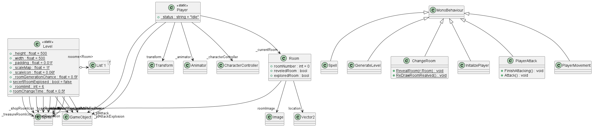

# ISSCa Binding Game Remake

Welcome to the ISSCa Binding Game Remake repository! In this project, we're revamping the classic ISSCa binding game into a modern 3D experience. Strap in and get ready for an immersive journey through space as you navigate and dock with the International Space Station (ISS).

## Description

The ISSCa Binding Game Remake is a space simulation game that challenges players to pilot a spacecraft and successfully dock with the ISS. Players will experience the thrill of space travel as they navigate through orbital trajectories, control their spacecraft's thrusters, and execute precise maneuvers to rendezvous with the station.

## Features

- **Immersive 3D Environment:** Explore a fully realized 3D rendition of space and the International Space Station.
- **Realistic Physics Simulation:** Experience accurate physics-based gameplay, including orbital mechanics and spacecraft dynamics.
- **Multiple Control Options:** Choose between simplified controls for casual players and advanced controls for experienced astronauts.
- **Mission Challenges:** Complete a series of increasingly difficult missions, from basic docking maneuvers to complex rendezvous scenarios.
- **Customization:** Customize your spacecraft with different modules, thrusters, and payloads to tailor your gameplay experience.
- **Training Mode:** Practice your piloting skills in a dedicated training mode with guided tutorials and challenges.

## Gameplay

In the ISSCa Binding Game Remake, players assume the role of an astronaut aboard a spacecraft tasked with docking with the International Space Station. Players must carefully manage their spacecraft's velocity, orientation, and trajectory to approach the station safely and dock with precision. Each mission presents unique challenges, such as avoiding space debris, managing fuel consumption, and dealing with communication delays.

## Installation

To play the ISSCA Binding Game Remake, download the game files from the repository and install them on your computer. The game will be available for Windows, macOS, and Linux platforms.

## PlantUML Diagrams

### Class Diagram

## Screenshots

<!-- 
 -->

<!-- ## Play the Game

You can play the game on [itch.io](https://your-username.itch.io/issca-binding-game-remake). Enjoy! -->

<!-- ## Gameplay Video

Check out the gameplay video [here](https://www.youtube.com/watch?v=your-video-id). -->

## Development

This game is developed using Unity3D game engine and programmed in C#. Contributions are welcome, whether it's bug fixes, feature enhancements, or optimizations.

<!-- ## Play the Original

If you're curious about the original ISSCa Binding Game, you can still play it [here](http://original-issca-binding-game-url.com). -->

## Credits

This game remake is created by Avinash Yadav. It is inspired by the original ISSCa Binding Game developed by [Original Developer Name].

## Feedback

If you have any feedback, suggestions, or bug reports, please open an issue on GitHub or contact us directly.

Prepare for liftoff and enjoy your journey to the International Space Station!

